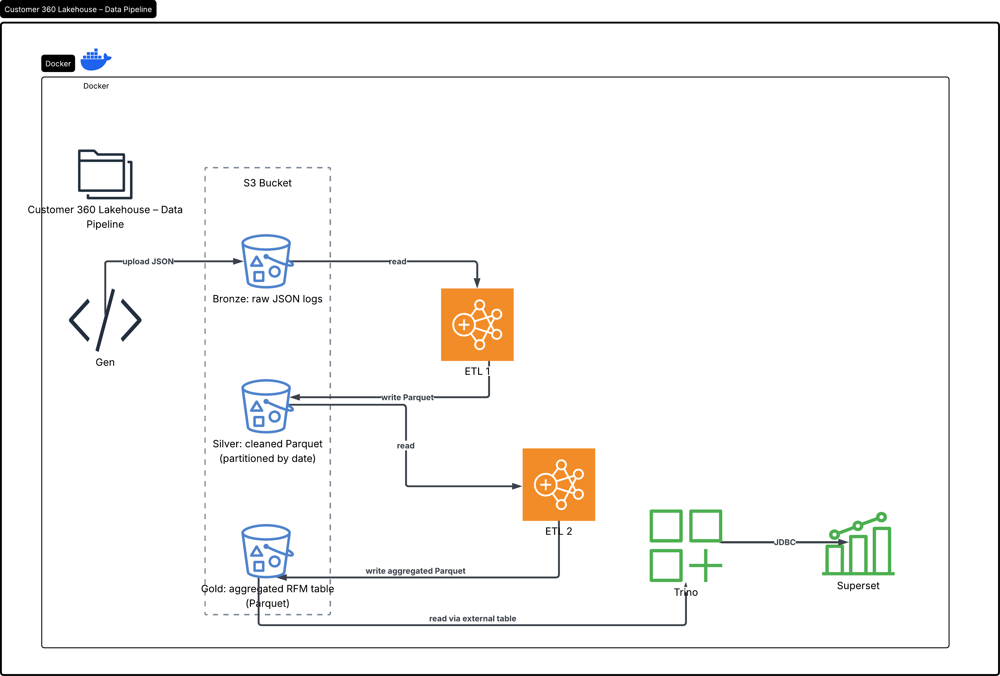
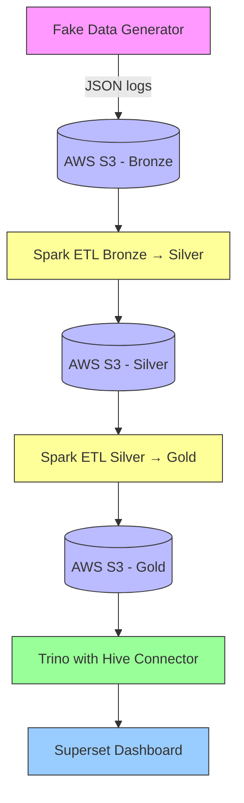

# Pipeline Lakehouse Customer 360

Pipeline xử lý dữ liệu log KPLUS sẵn sàng cho sản xuất, xây dựng với Apache Spark, Iceberg, Trino và Superset trên Docker, lưu trữ dữ liệu trên AWS S3.

## Sơ đồ Pipeline





## Các thành phần

| Thành phần          | Công nghệ                | Vai trò                                                                 |
|---------------------|--------------------------|-------------------------------------------------------------------------|
| Sinh dữ liệu giả    | Python + Faker           | Mô phỏng log KPLUS (tìm kiếm + nội dung) và tải lên S3 Bronze.          |
| Lưu trữ đối tượng   | AWS S3                   | Lưu dữ liệu thô (Bronze), đã làm sạch (Silver) và tổng hợp (Gold).      |
| Engine ETL          | Apache Spark (PySpark)   | Biến đổi dữ liệu từ Bronze → Silver → Gold theo phương thức incremental. |
| Định dạng bảng      | Apache Iceberg (tuỳ chọn)| Cung cấp ACID, time travel, tiến hóa schema (dùng cho Silver/Gold).     |
| Engine truy vấn     | Trino                    | Truy vấn SQL liên hợp trên bảng Parquet bên ngoài qua Hive connector.   |
| Điều phối           | Docker Compose + Shell   | Chạy ETL mỗi 5 phút, quản lý tất cả container.                          |
| Trực quan hoá       | Apache Superset          | Dashboard và biểu đồ tương tác.                                          |

## Tính năng

- Cửa sổ trượt 7 ngày – dữ liệu cũ hơn 7 ngày tự động bị xóa.
- ETL incremental – dựa trên checkpoint; chỉ xử lý dữ liệu mới.
- Sửa lỗi kiểu `double` của Trino – view ép kiểu `total_duration_sec` thành `BIGINT`.
- Đóng gói hoàn toàn bằng container – không phụ thuộc vào máy chủ.
- Cập nhật dashboard thời gian thực – ETL chạy mỗi 5 phút.

## Yêu cầu tiên quyết

- Tài khoản AWS có bucket S3 (ví dụ: `customer360-lakehouse`).
- AWS Access Key & Secret Key (có quyền đọc/ghi S3).
- Docker và Docker Compose trên EC2 (hoặc bất kỳ máy Linux nào).
- Git.

## Bắt đầu nhanh

### 1. Clone repository

```bash
git clone https://github.com/thnguyendinh/customer360-lakehouse.git
cd customer360-lakehouse
```

### 2. Cấu hình biến môi trường

Tạo file `.env`:

```bash
cat > .env <<EOF
AWS_ACCESS_KEY_ID=AKIA...
AWS_SECRET_ACCESS_KEY=...
AWS_DEFAULT_REGION=ap-southeast-1
S3_BUCKET=customer360-lakehouse
AIRFLOW_WWW_USER_USERNAME=admin
AIRFLOW_WWW_USER_PASSWORD=Admin@123
SUPERSET_ADMIN_USERNAME=admin
SUPERSET_ADMIN_PASSWORD=Admin@123
EOF
```

### 3. Khởi động tất cả dịch vụ

```bash
docker compose up -d
```

### 4. Kiểm tra container đang chạy

```bash
docker ps
```

Bạn sẽ thấy các container: `c360_generator`, `c360_trino`, `c360_spark`, `c360_superset`, v.v.

### 5. Truy cập dashboard Superset

- URL: `http://<EC2_PUBLIC_IP>:8088`
- Đăng nhập: `admin` / `Admin@123`

### 6. Chạy ETL thủ công (tuỳ chọn)

```bash
cd ~/customer360
source .env
docker run --rm \
  -v $(pwd)/src/spark_jobs:/app/spark_jobs \
  -v $(pwd)/src/config:/app/config \
  -w /app \
  -e HOME=/root \
  -e AWS_ACCESS_KEY_ID=${AWS_ACCESS_KEY_ID} \
  -e AWS_SECRET_ACCESS_KEY=${AWS_SECRET_ACCESS_KEY} \
  -e AWS_DEFAULT_REGION=${AWS_DEFAULT_REGION} \
  -e S3_BUCKET=${S3_BUCKET} \
  customer360-spark \
  /opt/spark/bin/spark-submit --master local[2] /app/spark_jobs/bronze_to_silver_incremental.py
```

## Luồng xử lý pipeline

1. **Sinh dữ liệu giả** – liên tục tạo log JSON (cả nội dung và tìm kiếm) và tải lên S3 với tiền tố `bronze/`, phân vùng theo ngày.
2. **Bronze → Silver (Incremental)** – Spark đọc dữ liệu thô mới (dựa trên checkpoint lưu trong S3), làm sạch, loại trùng, ghi dưới dạng Parquet vào `silver/` phân vùng theo ngày. Chạy mỗi 5 phút.
3. **Silver → Gold (Incremental)** – Spark đọc toàn bộ lớp Silver (hoặc chỉ dữ liệu mới) và tính toán các chỉ số RFM ở cấp độ người dùng: tần suất, độ mới, tổng thời gian xem, thời gian xem trung bình, số thiết bị, số ngày hoạt động và phân khúc RFM. Ghi đè lên bảng `gold/`.
4. **Trino & Hive Connector** – Trino sử dụng Hive connector để đọc trực tiếp các file Parquet trong `gold/`. Một view `customer_rfm_view` được tạo để ép kiểu `total_duration_sec` từ `double` sang `bigint`, giải quyết lỗi không tương thích kiểu trong Superset.
5. **Dashboard Superset** – Kết nối đến Trino, sử dụng view làm dataset, cung cấp các biểu đồ tương tác (phân bố RFM, thời gian xem theo vùng, khách hàng có nguy cơ rời bỏ, v.v.).

## Cấu trúc thư mục

```
customer360/
├── docker/
│   ├── spark/Dockerfile
│   ├── superset/Dockerfile
│   └── trino/catalog/hive.properties
├── src/
│   ├── spark_jobs/
│   │   ├── bronze_to_silver_incremental.py
│   │   └── silver_to_gold_incremental.py
│   ├── scripts/generate_data.py
│   └── config/spark_config.py
├── docker-compose.yml
├── .env
└── .gitignore
```

## Giám sát & Logging

- **Log ETL loop:** `tail -f ~/customer360/etl_auto.log`
- **Log generator:** `docker logs -f c360_generator`
- **Spark UI:** `http://<EC2_IP>:8080`
- **Trino UI:** `http://<EC2_IP>:8081`
- **Superset UI:** `http://<EC2_IP>:8088`
